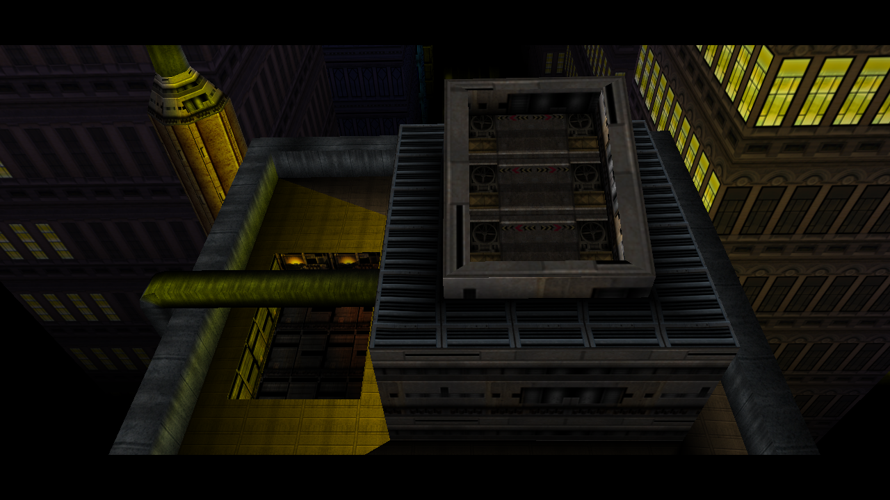
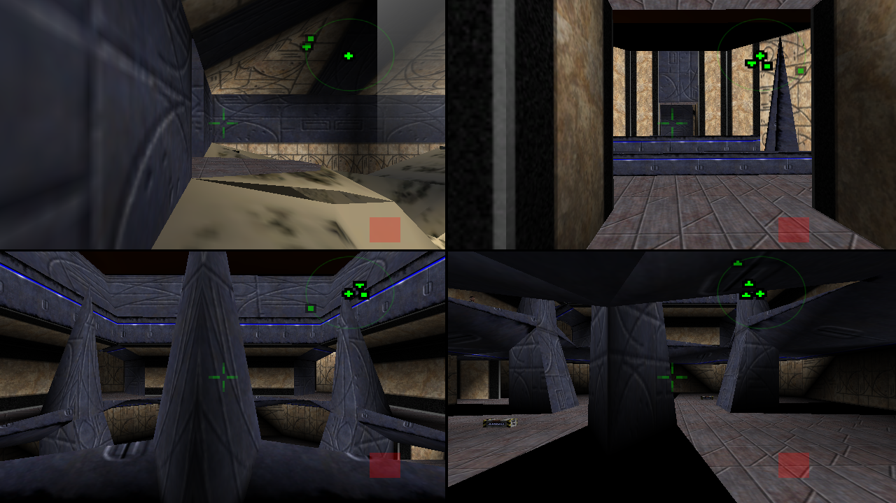

# Perfect Dark X

Perfect Dark X is an Original Xbox port of the open-source
[Perfect Dark PC port](https://github.com/perfect-dark-pc-port/perfect_dark),
which is based on the
[Perfect Dark decompilation project](https://github.com/n64decomp/perfect_dark).
It targets a stock 64 MiB Xbox through [nxdk](https://github.com/XboxDev/nxdk)
and uses a native pbkit/NV2A renderer, Xbox controller input, and direct AC97
audio output.

This repository contains source code and asset-processing tools. It does not
contain a Perfect Dark ROM, XBLA game data, or generated replacement textures.
You must own the source games and supply your own assets when building.

## Screenshots

<table>
  <tr>
    <td></td>
    <td></td>
  </tr>
  <tr>
    <td align="center">Single-player</td>
    <td align="center">Four-player split-screen</td>
  </tr>
</table>

Both images are native XEMU screenshots from a 1280x720 guest raster. They
have not been resized or captured from the desktop.

## Current status

This is a release-preview port. The campaign, combat simulator, menus, sound,
dual-analog controls, and two- to four-player split-screen are running on the
Original Xbox target. The game runs without keeping a 32 MiB N64 ROM resident:
the release image uses a loose extracted asset tree so the memory can instead
serve the game and renderer.

Implemented Xbox-specific work includes:

- native pbkit/NV2A rendering with Xbox video-mode negotiation;
- dashboard-controlled 480i, 480p, widescreen, and native 720p output;
- Hor+ world projection with existing HUD and menu safe-area behavior;
- direct 48 kHz stereo AC97 audio;
- Original Xbox controller support for up to four local players;
- bounded, demand-loaded diffuse texture replacements;
- ROM-free XDVDFS packaging from an owner-extracted loose asset tree;
- serial diagnostics, crash reporting, and a non-focus-stealing XEMU test
  harness with native emulator screenshots.

### Video modes

Resolution and aspect ratio come exclusively from the Xbox dashboard. There is
no in-game resolution or aspect-ratio override.

| Dashboard mode | Render raster | Presentation | Frame cap |
| --- | ---: | --- | ---: |
| 480i | 640x480 | Dashboard 4:3 or anamorphic 16:9 | 60 FPS |
| 480p | 640x480 | Dashboard 4:3 or anamorphic 16:9 | 60 FPS |
| 720p | 1280x720 | 16:9 only | 30 FPS |

The 720p path verifies both the active Xbox video raster and pbkit back buffer
before continuing. If the mode or its recoverable surface allocation fails,
the game falls back to dashboard-aspect 640x480. At 720p, framebuffer effects
are disabled and the external-texture residency budget is reduced to protect
the stock 64 MiB memory configuration.

Stationary 720p split-screen qualification currently measures:

| Layout | Average | Minimum | Maximum |
| --- | ---: | ---: | ---: |
| 2 players | 28.669 FPS | 27.139 FPS | 29.991 FPS |
| 3 players | 29.771 FPS | 29.558 FPS | 30.134 FPS |
| 4 players | 29.749 FPS | 29.466 FPS | 30.069 FPS |

These are layout and memory-residency baselines, not worst-case combat or
explosion benchmarks.

### Known limitations

- Visual parity is still being refined, particularly framebuffer-dependent
  effects and some scripted presentation at 720p.
- The 720p tier intentionally trades effects and texture residency for a native
  widescreen raster and stable memory use. The 480-line path remains the
  compatibility target.
- The XBLA diffuse pack is conservatively matched against stock N64 textures.
  Unmatched textures fall back to the original N64 asset.
- XBLA-only bump, normal, specular, cubemap, and other material maps are not
  loaded.

## Installing a release

### Requirements

- A modified Original Xbox capable of launching unsigned XBE files, or XEMU.
- For 480p or 720p on hardware, a compatible HD AV/component setup and those
  modes enabled in the Microsoft dashboard.
- 720p is always widescreen. Use the dashboard's 480-line 4:3 mode for a 4:3
  display.

Release archives contain `pdx-textures.iso`, an Xbox XDVDFS image. It is not a
standard ISO 9660 disc image.

### Original Xbox: folder installation

1. Extract `pdx-textures.iso` with an XDVDFS-aware Xbox ISO tool such as
   `extract-xiso`. Windows Explorer and ordinary ISO tools will not extract it
   correctly.
2. Transfer the extracted directory to a games folder on the Xbox hard drive,
   for example `F:\Games\Perfect Dark X`, using FTP or another Xbox-aware
   transfer method.
3. Confirm the folder contains `default.xbe`, `pd.ini`, `filenames.lst`,
   `files`, `segs`, and `ext_tex.pak`.
4. Configure aspect ratio and HD modes in the Microsoft dashboard before
   launching the game.
5. Launch `default.xbe` from the replacement dashboard.

A dashboard or BIOS with direct XISO support may launch `pdx-textures.iso`
without extracting it. Consult that loader's documentation; folder installation
is the most broadly compatible method.

### XEMU

1. Configure XEMU with a compatible MCPX ROM, Xbox BIOS, hard-disk image, and
   EEPROM.
2. Enable the desired widescreen/progressive modes in the emulated Microsoft
   dashboard.
3. Load `pdx-textures.iso` as the game disc and start the emulator.
4. When using 720p, set XEMU's presentation aspect to 16:9. Some XEMU versions
   can choose a 4:3 host surface when their presentation setting is left on
   `Auto`, even though the guest is rendering 1280x720.

## Controls

The default Xbox-style scheme uses both analog sticks:

| Action | Original Xbox controller |
| --- | --- |
| Move | Left stick |
| Look / aim | Right stick |
| Fire / accept | Right trigger |
| Aim mode | Left trigger |
| Use / accept | A |
| Previous weapon / cancel | B |
| Reload | X |
| Next weapon | Y |
| Radial menu | Black |
| Alternative fire | White |
| Crouch cycle | Left thumbstick click |
| Pause | Start |

Controls can also be adjusted through the game's control options. Each local
player is assigned a connected controller during startup.

## Building the Xbox port

### Prerequisites

- Windows with PowerShell or an MSYS2 environment;
- [nxdk](https://github.com/XboxDev/nxdk) at `C:\nxdk`;
- CMake and Ninja;
- LLVM/Clang supported by nxdk;
- Python 3;
- a legally owned `ntsc-final`/US v1.1 Perfect Dark ROM with MD5
  `e03b088b6ac9e0080440efed07c1e40f`.

The commands below are shown for PowerShell from the repository root.

### 1. Extract the loose game data

```powershell
python tools/extract-loose pd.ntsc-final.z64 `
  --romid ntsc-final --out build/loose
```

The output contains `files/`, `segs/`, and `filenames.lst`. These generated,
copyrighted assets are ignored by Git and must not be committed.

### 2. Configure and build the XBE

```powershell
$env:NXDK_DIR = 'C:\nxdk'
$env:Path = 'C:\msys64\mingw64\bin;C:\Program Files\LLVM\bin;' + $env:Path

cmake -S . -B build-xbox -G Ninja `
  -DCMAKE_TOOLCHAIN_FILE=cmake/toolchain-nxdk.cmake `
  -DCMAKE_MAKE_PROGRAM=C:/msys64/mingw64/bin/ninja.exe `
  -DCMAKE_BUILD_TYPE=Release

cmake --build build-xbox --parallel
```

The resulting executable is `build-xbox/default.xbe`.

### 3. Build the optional diffuse texture pack

The replacement pack requires an owner-supplied Perfect Dark XBLA archive.
Extraction and matching are intentionally separate from the game build:

- [XBLA extraction tools](tools/xbla/README.md)
- [N64-to-XBLA texture matching and Xbox packaging](tools/texturepack/README.md)

The final pack is `texturepack-work/release/ext_tex.pak`.

### 4. Pack the release XISO

With the replacement texture pack:

```powershell
python scripts/pack-loose-xiso.py `
  --xbe build-xbox/default.xbe `
  --loose build/loose `
  --texture-pack texturepack-work/release/ext_tex.pak `
  --out build-xbox/pdx-textures.iso
```

For a stock-texture build, omit `--texture-pack`. Qualification-only
`pdx_boot.ini` overrides are accepted only through the packer's `--boot-ini`
argument and must never be included in a release image.

## Project lineage and credits

Perfect Dark X is a platform port, not a standalone reimplementation. The full
desktop/Switch documentation and history remain available in the
[upstream PC-port README](https://github.com/perfect-dark-pc-port/perfect_dark/blob/port/README.md).

Major upstream foundations include:

- the [Perfect Dark decompilation](https://github.com/n64decomp/perfect_dark)
  contributors;
- the [Perfect Dark PC port](https://github.com/perfect-dark-pc-port/perfect_dark)
  contributors;
- the sm64-port and libultraship Fast3D work credited by the upstream project;
- [nxdk](https://github.com/XboxDev/nxdk), pbkit, and the XboxDev community;
- [XEMU](https://xemu.app/) for development and qualification.

See [LICENSE](LICENSE) for this repository's software license. Perfect Dark and
its game assets belong to their respective rights holders; no affiliation or
endorsement is implied.
